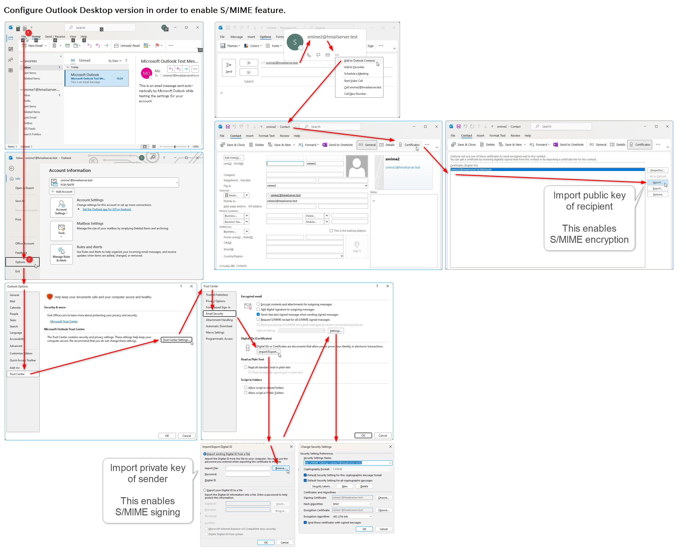

# S/MIME mail samples

This repository contains sample `.eml`, `.msg`, and `.pfx` files in order to simulate S/MIME encryption and decryption.

There are 3 certificates and their corresponding intermediate artifacts in the folder `certs`:

```
"CN=CA 20240817143342" (cers/ca_smime.crt)
  "CN=smime1@hmailserver.test" (certs/smime-1-secret.pfx)
  "CN=smime2@hmailserver.test" (certs/smime-2-secret.pfx)
```

I have used [hMailServer - Free open source email server for Microsoft Windows](https://www.hmailserver.com/) to construct POP3/SMTP servers at localhost, and then creating mail addresses like `smime1@hmailserver.test` and `smime2@hmailserver.test`.

How to configure Thunderbird with self signing certificates:


How to configure Microsoft Outlook with self signing certificates:



How to import `ca_smime.crt` ROOT CA of self signing certificates:


How to eliminate `ca_smime.crt` ROOT CA from registry:

```bat
certutil -user -delstore Root "ff4ea1c31a70e2a53630a2bfb51deebbcf407b10"
```

Or use the following instruction:


